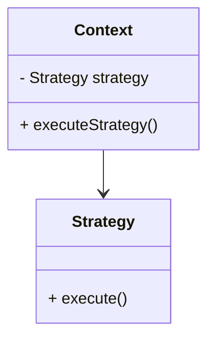

# Strategy Pattern

## Overview

The Strategy pattern is a behavioral design pattern that allows you to define a family of algorithms, encapsulate each one, and make them interchangeable. This pattern lets the algorithm vary independently from clients that use it.

## UML Diagram

Description:

- Context: The context class is responsible for holding a reference to the strategy object and delegating the work to it.
- Strategy: The strategy interface defines the contract for the strategies.
- ConcreteStrategy: The concrete strategy classes implement the strategy interface.
